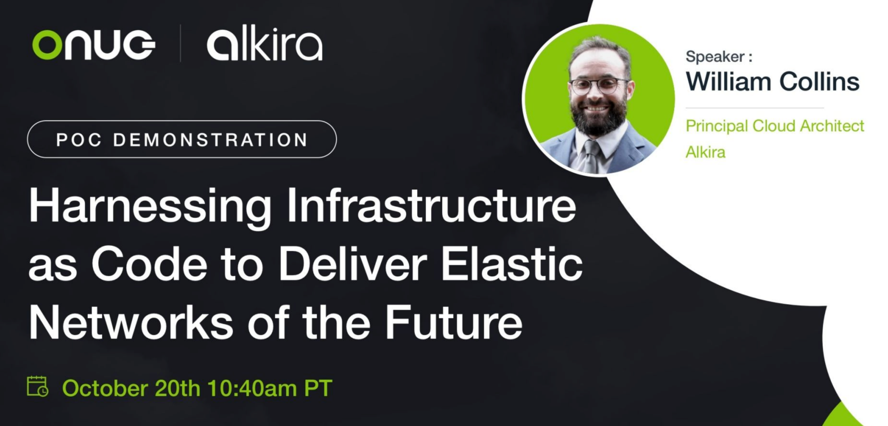

### Event: [ONUG - Fall 2021](https://onug.net/fall-2021/)

### Session: [Harnessing Infrastructure as Code to Deliver Elastic Networks of the Future](https://onug.net/events/alkira-proof-of-concept-harnessing-infrastructure-as-code-to-deliver-elastic-networks-of-the-future/)

### Description
Automation is now a business imperative that underpins elasticity and intersects directly with business outcomes. In this demonstration, William Collins, Principal Cloud Architect at Alkira, will deploy a production-grade network spanning multiple clouds and sites with unified segmentation and security services, all via code and delivered using CI/CD. Realize what is possible when Alkira Cloud Services Exchange (CSX) unifies the network and Infrastructure as Code takes the driver’s seat.